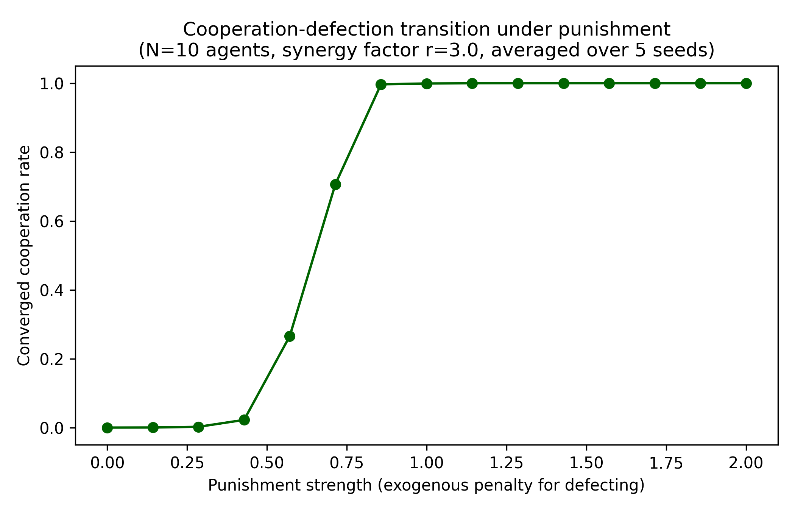

# Cooperation Under Punishment: A Toy MARL Simulation

A small independent Q-learning simulation of an iterated N-player Public
Goods Game, built as a computational bridge between:

- **Statistical-mechanics treatments of cooperation/defection**, in the
  spirit of Ising-type Hamiltonian models with punishment/coupling terms
  (see: Choudhury & Balakrishnan, *Quantum Information Processing*, 2025),
  where cooperation emerges as a collective phase above a critical
  coupling strength.
- **Multi-agent reinforcement learning**, where cooperation is not
  imposed by a Hamiltonian but *learned* by self-interested agents
  through repeated play and reward feedback.

## The model

N independent tabular Q-learning agents repeatedly play a Public Goods
Game. Each agent chooses to **cooperate** (contribute to a common pool)
or **defect** (free-ride). Contributions are pooled, multiplied by a
synergy factor `r`, and redistributed equally to all agents. For
`1 < r < N`, this is a genuine social dilemma: mutual cooperation is
collectively optimal, but free-riding is individually dominant.

An exogenous **punishment mechanism** is added: defectors incur an
additional penalty of strength `p`, representing an external
enforcement/arbiter mechanism (echoing the Arbiter role in the
Ising-DM three-player framework from the thesis work above). Agents
use softmax (Boltzmann) exploration over Q-values with an annealed
temperature `tau` which a deliberate nod to the statistical-mechanics
origin of this exploration scheme.

## Key result

Sweeping the punishment strength `p` at a fixed synergy factor in the
dilemma range reveals a clear **threshold transition**: below a
critical `p`, agents converge to full defection (individually
rational); above it, they converge to full cooperation. This is a
direct computational analogue of the punishment thresholds studied in
the Ising-DM cooperation/defection framework which is now realized as an
emergent property of learning dynamics rather than imposed by a
Hamiltonian.



Two supporting plots are also included:
- `training_curve.png`: cooperation rate over training rounds for a
  single run (no punishment) — shows convergence to full defection.
- `phase_diagram.png`: converged cooperation rate as a function of the
  synergy factor `r` (no punishment) — confirms that synergy alone,
  without enforcement, does not produce cooperation in this dilemma
  range.

## Files

- `public_goods_qlearning.py` — full simulation, sweep, and plotting code.
- `training_curve.png`, `phase_diagram.png`, `punishment_phase_diagram.png`
  — output figures.

## Status / next steps

This is a first, deliberately minimal step. Planned extensions (as part
of ongoing self-study in reinforcement learning and multi-agent
reinforcement learning):

- Replace the single-state stateless bandit setup with a proper
  repeated-game state (e.g. conditioning on the previous round's
  aggregate cooperation level).
- Move from independent Q-learning to BRG-style (Best Response Guided)
  training dynamics, and study prethermalization in the resulting
  training trajectories.
- Extend to heterogeneous populations and look for a spin-glass-like
  intermediate phase between full cooperation and full defection.

## Requirements

```
numpy
matplotlib
```

Run with:

```
python public_goods_qlearning.py
```
